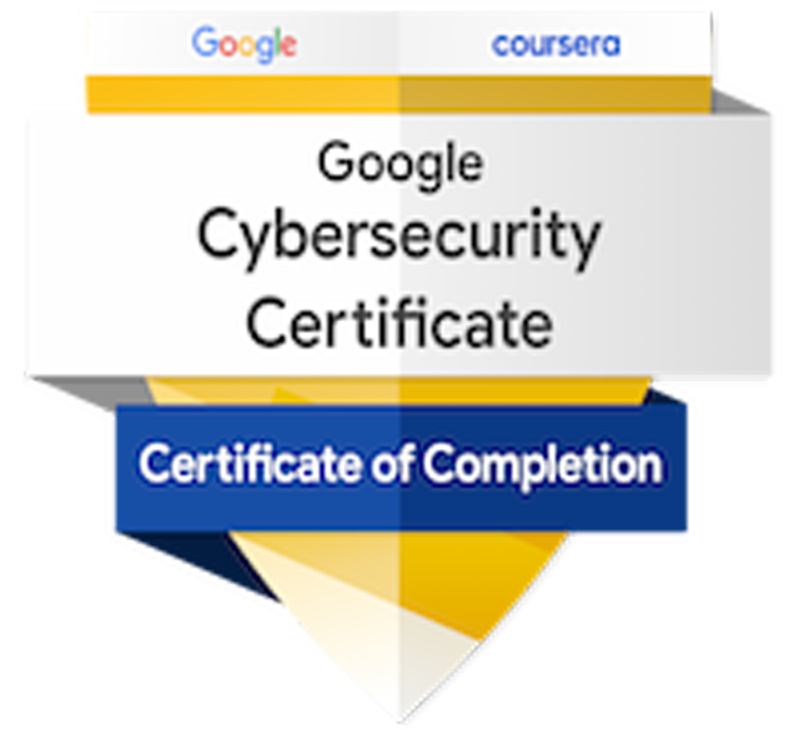

# Cybersecurity Professional

## Summary:
As a recent graduate deeply passionate about cybersecurity, I come prepared with a solid blend of academic knowledge and practical skills honed through rigorous training and industry certifications. My academic journey has provided me with a profound grasp of the complexities within cybersecurity, while my pursuit of professional certifications reflects my dedication to staying ahead in this constantly evolving field.

## Education:
- PG Diploma in Wireless Information Networking (April 2023) - 𝑭𝒍𝒆𝒎𝒊𝒏𝒈 𝑪𝒐𝒍𝒍𝒆𝒈𝒆, 𝑷𝒆𝒕𝒆𝒓𝒃𝒐𝒓𝒐𝒖𝒈𝒉, 𝑶𝒏𝒕𝒂𝒓𝒊𝒐

- BSc Electronics (March 2020) - 𝑷𝒓𝒂𝒋𝒚𝒐𝒕𝒊 𝑵𝒊𝒌𝒆𝒕𝒂𝒏 𝑪𝒐𝒍𝒍𝒆𝒈𝒆, 𝑲𝒆𝒓𝒂𝒍𝒂, 𝑰𝒏𝒅𝒊𝒂

## Professional Certifications:
- CompTIA Security+ ce certificate  
- Google Cybersecurity Professional Certificate  
- CompTIA A+ Cyber Specialization (Currently Enrolled) 

     

## Projects:
- Threat Actor Detection Lab 

## Tools:
 Splunk  Nessus

      
 

